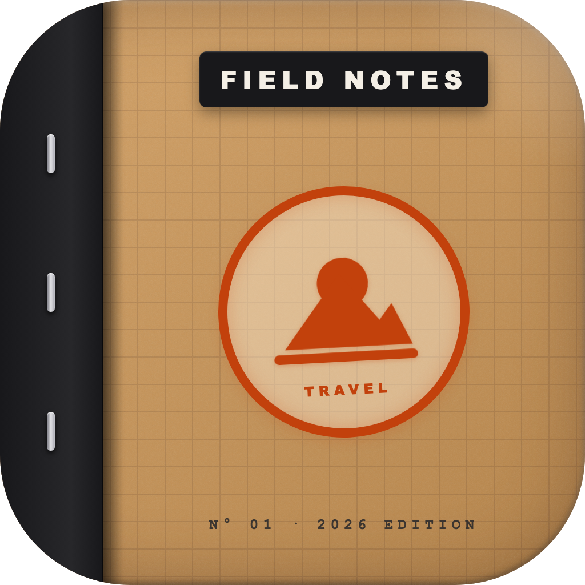

# FIELDS: Travel Journal & Scrapbook

<p align="center">
  
</p>

<p align="center">
  <strong>Transform your travel photographs into timeless carved stamp prints, vintage travel posters, and field note memories.</strong>
</p>

<p align="center">
  <a href="https://fields-journal.vercel.app"></a>
  <a href="https://turso.tech"></a>
  <a href="https://expo.dev"></a>
  <a href="https://reactnative.dev"></a>
</p>

---

## ✦ Overview

**Fields: Travel Journal & Scrapbook** is an editorial travel diary and artistic memory-keeping application built for iOS and Android. Inspired by mid-century national park field guides, archival travel scrapbooks, and traditional relief printmaking, Fields distills the atmosphere, light, and geometry of your travel photos into handcrafted linocut stamp posters.

The app features an end-to-end cloud serverless backend deployed on **Vercel** with a distributed **Turso Cloud SQLite** database, providing instant response times, zero maintenance, and \$0/month idle infrastructure costs.

---

## ✦ Core Features & Capabilities

### 1. Linocut Stamp & Poster Generation
* **Dual AI Printmaker Engine**: Integrates Google Gemini 2.5 Flash and xAI Grok Imagine to intelligently analyze scenery, architecture, and lighting to generate relief woodblock and linocut stamp artwork.
* **4:3 Aspect Ratio Field Note Composition**: Beautifully proportions the original captured photo on the left (~58%) against an archival aged-paper panel on the right (~42%) featuring a minimalist carved rubber-stamp motif, destination coordinates, and typewriter typography.
* **Paper Grain & Ink Bleed**: Incorporates authentic organic paper textures, deckled borders, and analog ink pressure variations.

### 2. Smart Travel Metadata & EXIF Detection
* **Automatic Geocoding**: Extracts GPS coordinates and reverse-geocodes photos into recognizable city, region, and country labels.
* **Temporal Tracking**: Reads photo capture timestamps to automatically assign the travel year and date.
* **Edition Numbering**: Sequential numbering system (`No. 01`, `No. 02`, etc.) giving every field note the feel of a limited-edition lithograph.

### 3. AI Sensory Memory Keywords
* Rather than generic hashtags, Fields analyzes the photo and location context to suggest three evocative sensory keywords (e.g., `"Salt Spray"`, `"Limestone"`, `"Golden Hour"`, `"Pinyon Pine"`).
* Full manual customization allows travelers to preserve their own personal memories of the moment.

### 4. Digital Scrapbook & Stamped Passport
* **Archival Grid**: Browse all previously created field notes in a clean, high-density scrapbook grid.
* **Chronological Sorting**: Filter your journey by year, destination, or edition number.
* **Local Offline Storage**: All finalized field notes are cached locally on device using Zustand and secure persistent storage.

### 5. High-Resolution Export & Sharing
* One-tap export to the native device photo gallery in ultra-high resolution.
* Native sharing sheet optimized for Instagram Stories, Pinterest, digital scrapbooking, or physical art printing.

---

## ✦ Monetization & Entitlement Architecture

Fields implements a customer-friendly, transparent hybrid monetization model powered by **RevenueCat** and **Google Mobile Ads (AdMob)**:

| Tier | Access Quota | Cost | Monetization Mechanism |
| :--- | :--- | :--- | :--- |
| **Notes 1 & 2** | 2 Field Notes | **Free** | Instant complimentary access on first download. |
| **Note 3** | 1 Field Note | **Ad-Supported** | Unlocked after watching a single Google AdMob rewarded video ad. |
| **Notes 4+** | Pay-As-You-Go | **\$2.99 / 20 Notes** | Consumable credit pack (`notes_20`) via Google Play Billing. |
| **Pro Unlimited** | Unlimited | **Subscription** | Monthly, Yearly, or Lifetime Pro subscription with unlimited generation. |

### Balance Protection & Anti-Abuse
* **Fail-Safe Rollback**: If an image generation is interrupted, times out, or fails server-side, user credits and free quotas are automatically preserved.
* **Hardware & Cloud Sync**: Entitlements are tied to device hardware identifiers and RevenueCat User IDs stored in Turso Cloud SQLite, preventing quota reset exploits on app reinstallation.

---

## ✦ Architecture & Tech Stack

```
                               ┌──────────────────────────────────────────────┐
                               │             FIELDS MOBILE CLIENT             │
                               │  Expo SDK 54 • React Native 0.81 • React 19  │
                               │      Expo Router • Zustand • RevenueCat      │
                               └──────────────────────┬───────────────────────┘
                                                      │ HTTPS / JSON & Multipart
                                                      ▼
                               ┌──────────────────────────────────────────────┐
                               │           VERCEL SERVERLESS API              │
                               │           https://fields-journal.vercel.app  │
                               │                                              │
                               │  • /health             • /v1/me              │
                               │  • /v1/notes           • /v1/credits/sync    │
                               │  • /v1/keywords/suggest                      │
                               └──────────────┬───────────────────────────────┘
                                              │
                     ┌────────────────────────┼────────────────────────┐
                     ▼                        ▼                        ▼
      ┌─────────────────────────┐  ┌─────────────────────┐  ┌─────────────────────┐
      │    TURSO CLOUD SQLITE   │  │  GOOGLE GEMINI API  │  │   xAI GROK IMAGINE  │
      │  libsql distributed db  │  │  2.5 Flash Vision   │  │   Image Edit 2.0    │
      │  Users, credits, logs   │  │  Visual analysis    │  │   Linocut print art │
      └─────────────────────────┘  └─────────────────────┘  └─────────────────────┘
```

### Client Technologies
* **Framework**: [Expo SDK 54](https://expo.dev/) (Managed Workflow + Prebuild)
* **Runtime**: React Native 0.81.5, React 19
* **Navigation**: [Expo Router v6](https://docs.expo.dev/router/introduction/) (File-based routing with typed routes)
* **State Management**: [Zustand v5](https://github.com/pmndrs/zustand) with async storage persistence
* **In-App Purchases**: [RevenueCat](https://www.revenuecat.com/) (`react-native-purchases` & `react-native-purchases-ui`)
* **Mobile Ads**: [Google Mobile Ads](https://github.com/invertase/react-native-google-mobile-ads) (`react-native-google-mobile-ads`)
* **Camera & Media**: `expo-image-picker`, `expo-media-library`, `expo-image-manipulator`, `expo-location`

### Cloud Infrastructure
* **Serverless Compute**: [Vercel](https://vercel.com/) (Node.js 20 Serverless Runtime with Hono)
* **Database**: [Turso](https://turso.tech/) (Distributed SQLite over libSQL WebSocket/HTTP)
* **Web Landing & Legal**: Static, mobile-responsive compliance website served from Vercel Edge (`/`, `/privacy`, `/terms`)

---

## ✦ Project Directory Structure

```
Field Notes/
├── app/                          # Expo Router file-based screens
│   ├── _layout.tsx               # Root application layout, font loading & theme
│   ├── index.tsx                 # Home screen: Travel scrapbook grid & action bar
│   ├── compose.tsx               # Compose screen: Photo picker, metadata & keywords
│   ├── pressing.tsx              # Generation screen: Atmospheric progress state
│   ├── result.tsx                # Result screen: 4:3 poster viewer, save & share
│   ├── settings.tsx              # Settings: Entitlements, credit restore & terms
│   ├── privacy.tsx               # In-app privacy disclosure & data safety details
│   └── modal/
│       ├── paywall.tsx           # In-app purchase sheet ($2.99 / 20 credits pack)
│       └── privacy-consent.tsx   # First-run AI processing consent sheet
│
├── assets/                       # Visual assets, branding, fonts, icons & splash
│   ├── icon.png                  # App icon (1024x1024)
│   ├── adaptive-icon.png         # Android adaptive foreground icon
│   └── splash.png                # Launch screen illustration
│
├── src/
│   ├── components/               # Reusable UI components (PaperContainer, StampButton)
│   ├── lib/                      # Core business logic modules
│   │   ├── api.ts                # API client pointing to production Vercel backend
│   │   ├── purchases.ts          # RevenueCat SDK integration & entitlement checks
│   │   ├── ads.ts                # Google AdMob rewarded ad controller
│   │   └── location.ts           # EXIF parsing & reverse-geocoding utilities
│   ├── store/                    # Zustand persistent application state
│   ├── theme/                    # Paper color palettes, serif typography & spacing
│   └── types/                    # TypeScript interfaces & API schemas
│
├── server/                       # Backend service (Hono + TypeScript)
│   ├── api/index.ts              # Vercel serverless request listener bridge
│   ├── src/
│   │   ├── index.ts              # Route declarations (/v1/notes, /v1/me, /v1/keywords)
│   │   ├── db.ts                 # Turso Cloud SQLite schema & balance state machine
│   │   ├── gemini.ts             # Google Gemini 2.5 Flash image generation service
│   │   ├── grok.ts               # xAI Grok Imagine 2.0 image editing service
│   │   ├── keywords.ts           # Sensory keyword AI extraction prompt
│   │   └── prompt.ts             # Server-locked master linocut prompt builder
│   └── package.json              # Server dependencies & build scripts
│
├── public/                       # Static web assets for store compliance
│   ├── index.html                # Marketing landing page
│   ├── privacy.html              # Web privacy policy for Google Play compliance
│   └── terms.html                # Terms of service for App Store compliance
│
├── api/index.js                  # Pre-bundled Vercel serverless entry point
├── app.json                      # Expo app configuration & native plugin declarations
├── eas.json                      # Expo Application Services (EAS) build profiles
├── vercel.json                   # Vercel routing rules, rewrites & headers
└── package.json                  # Root dependencies & package scripts
```

---

## ✦ Getting Started Locally

### 1. Prerequisites
* **Node.js**: `>= 20.0.0`
* **npm**: `>= 10.0.0`
* **EAS CLI**: `npm install -g eas-cli`
* **Android Studio & SDK**: (Optional, for local compilation)

### 2. Installation
```bash
# Clone repository
git clone https://github.com/itstoasti/fields-Journal.git
cd fields-Journal

# Install root dependencies
npm install

# Install server dependencies
npm install --prefix server
```

### 3. Environment Setup
Create a `.env` file in the project root:
```env
# Mobile Client (.env)
EXPO_PUBLIC_API_URL=https://fields-journal.vercel.app
EXPO_PUBLIC_REVENUECAT_API_KEY=test_kejmcZYQWmrefaSizVLCGOzPWDB
EXPO_PUBLIC_RC_PRODUCT_NOTES_20=notes_20
EXPO_PUBLIC_RC_ENTITLEMENT_ID=fields_travel_journal_scrapebook_pro
```

---

## ✦ Building for Production (Google Play & App Store)

### 1. Android App Bundle (`.aab`)
Production builds are built and signed in the cloud via EAS Build:
```bash
eas build --platform android --profile production
```
* **Output**: Production `.aab` bundle ready for Google Play Console Internal / Closed testing tracks.
* **Keystore**: Managed remotely via EAS Credentials.

### 2. Google Play Store Compliance URLs
* **Marketing Landing**: `https://fields-journal.vercel.app`
* **Privacy Policy**: `https://fields-journal.vercel.app/privacy`
* **Terms of Service**: `https://fields-journal.vercel.app/terms`

---

## ✦ License

Copyright © 2026 Fields. All rights reserved. Private and proprietary.
